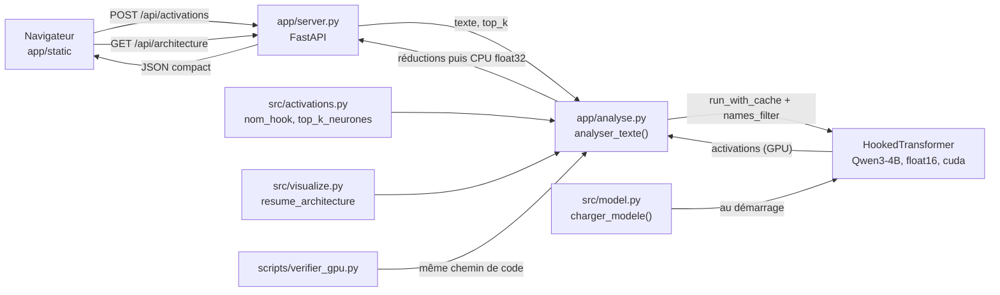

# Architecture du code

Ce document décrit brièvement le rôle de chaque fichier du projet.

| Fichier | Rôle |
|---|---|
| `main.py` | Point d'entrée : lit les options de la ligne de commande, puis enchaîne chargement du modèle → affichage de l'architecture → capture des activations → affichage des neurones les plus activés et les plus similaires au concept. |
| `src/__init__.py` | Fait de `src/` un paquet Python et documente son contenu. |
| `src/model.py` | Charge le modèle (par défaut `Qwen/Qwen3-8B-Base`, constante `MODEL_NAME`) en float16 sur GPU sous forme de `HookedTransformer`. Gère le cas des variantes « Base » absentes de la liste officielle de TransformerLens et affiche une erreur claire si CUDA manque. |
| `src/concepts.py` | Contient la liste des concepts de test (« Bible », « chrétien », « Jordan Peterson » et des concepts neutres) et calcule leur vecteur dans l'espace `d_model` (moyenne des lignes de `W_E`, ou moyenne du flux résiduel à une couche). |
| `src/activations.py` | Capture les activations d'une couche (flux résiduel, attention, MLP) avec `run_with_cache` et `names_filter`, trouve les neurones les plus activés (`top_k_neurones`) et mesure la similarité cosinus entre un concept et les directions des neurones (`W_in`, `W_out`, `W_gate`). |
| `src/visualize.py` | V1 : affiche l'architecture dans la console. V2 : exporte les activations en JSON (actif) et contient une vue Streamlit interactive prête mais commentée. |
| `app/__init__.py` | Fait de `app/` un paquet Python (interface graphique). |
| `app/analyse.py` | Cœur de l'interface : `analyser_texte()` fait **un seul** passage avant (`run_with_cache` + `names_filter` sur `resid_post`, `attn_out`, `mlp_post`, `pattern` de toutes les couches, sous `torch.inference_mode()`), réduit chaque tenseur sur le GPU puis le passe sur CPU (float32, arrondi), supprime le cache et vide la mémoire CUDA. Réutilise `nom_hook` et `top_k_neurones` (`src/activations.py`) et `resume_architecture` (`src/visualize.py`). Gère les erreurs texte vide / trop long / mémoire GPU insuffisante (messages en français). |
| `app/server.py` | Serveur FastAPI + uvicorn (`python -m app.server`) : charge le modèle une seule fois (`charger_modele`, par défaut `Qwen/Qwen3-4B` sur `cuda` en float16), affiche le GPU et la VRAM libre au démarrage, expose `GET /api/architecture` et `POST /api/activations`, et sert le front-end statique. Un verrou fait passer les requêtes une par une sur le GPU. |
| `app/static/index.html` | Page unique de l'interface (en français). |
| `app/static/style.css` | Styles : palette pastel inspirée de « The Illustrated Transformer », polices système, animations légères. |
| `app/static/app.js` | JavaScript natif : appels à l'API, cartes d'architecture, tokens, carte d'activation couches × tokens, pile des couches dépliable (top-k neurones, cartes de chaleur des têtes sur `<canvas>`). |
| `scripts/verifier_gpu.py` | Vérification sur GPU : charge Qwen3-4B, fait passer une phrase par `analyser_texte()` (même chemin que l'API) et affiche un résumé par couche, les durées et le pic de VRAM (code de sortie 0 en cas de succès). |
| `results.txt` | Exemple de sortie console de `main.py` avec Qwen/Qwen3-4B sur GPU. |
| `requirements.txt` | Liste des dépendances Python avec les versions minimales nécessaires (TransformerLens ≥ 2.16 et < 4.0, FastAPI, uvicorn). |
| `README.md` | Guide d'installation et d'utilisation pour débutants, feuille de route. |
| `.gitignore` | Exclut caches, environnements virtuels, poids de modèles et exports. |

## Flux de données

1. **Chargement du modèle** (`model.py`) : les poids sont téléchargés depuis le Hub Hugging Face au premier lancement, puis convertis en `HookedTransformer`.
2. **Capture des activations** (`concepts.py` + `activations.py`) : le concept est tokenisé, passé dans le modèle, et les activations de la couche choisie sont enregistrées.
3. **Visualisation** (`visualize.py`) : affichage console (V1), export JSON (V2), puis interfaces interactives (V2/V3).

## Chemin de l'interface graphique

1. **Démarrage** (`app/server.py`) : vérification de CUDA, affichage du GPU et de la VRAM libre, chargement unique du modèle via `src/model.py`.
2. **Requête** : le navigateur envoie `POST /api/activations` avec `{"texte", "top_k"}`.
3. **Analyse** (`app/analyse.py`) : tokenisation (limite `--max-tokens`, 128 par défaut), un passage avant avec `names_filter`, réductions par couche (normes, magnitude MLP, top-k neurones, résumé des têtes, attention du dernier token, motif moyen si le texte est court), passage sur CPU, libération de la mémoire.
4. **Affichage** (`app/static/app.js`) : cartes d'architecture, tokens, carte d'activation, pile des couches.

