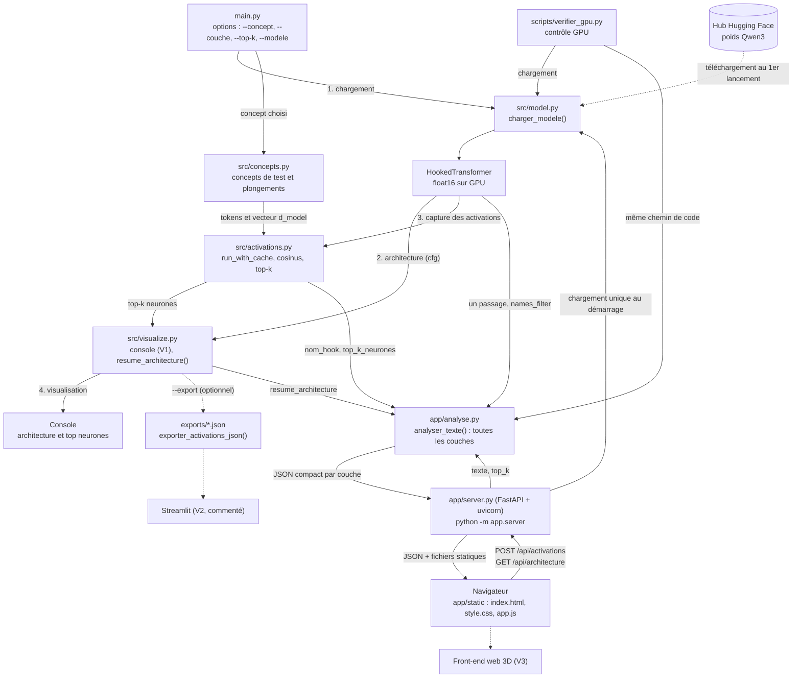

# llm-visualizer — Visualiser l'intérieur d'un grand modèle de langage

## À quoi sert ce projet ?

Un grand modèle de langage (LLM) est une énorme pile de couches de calcul. Ce projet permet
de **regarder à l'intérieur** :

- **l'architecture** : combien de couches, de neurones, de têtes d'attention, de paramètres… ;
- **les activations** : quels neurones « s'allument » lorsque le modèle lit un mot ou un concept
  (par exemple « Bible », « chrétien » ou « Jordan Peterson »).

Le déroulement global est toujours le même :

> **chargement du modèle → capture des activations → visualisation**

## Choix techniques (récapitulatif)

- **Modèle** : `Qwen/Qwen3-8B-Base` (Qwen3, 8 milliards de paramètres, version « Base », non
  instruite). Remarque : « Qwen 3.8B » n'existe pas ; le modèle se change via la constante
  `MODEL_NAME` en haut de `src/model.py` ou l'option `--modele`.
- **Précision** : float16, sur **GPU (CUDA)**.
- **Bibliothèque** : [TransformerLens](https://github.com/TransformerLensOrg/TransformerLens),
  via `HookedTransformer`, qui donne accès à toutes les activations internes par des « hooks ».
- **V1 (actuelle)** : affichage de l'architecture dans la console + top des neurones activés.
- **V2 / V3 (préparées)** : activations par neurone, export JSON, interface Streamlit
  (commentée), puis front-end web 3D, analyse de concepts comme « Bible », « chrétien »,
  « Jordan Peterson ».
- Aucun poids de modèle n'est inclus dans le projet : ils sont téléchargés depuis Hugging Face au
  premier lancement (puis gardés en cache dans `~/.cache/huggingface`).

## Prérequis

- Python 3.10 à 3.12 (recommandé).
- Un GPU NVIDIA avec **au moins 16 Go de VRAM** (idéalement 20–24 Go) : 8 milliards de
  paramètres × 2 octets (float16) ≈ 16 Go, plus la mémoire des activations.
  Prévoyez aussi ~32 Go de RAM et ~20 Go d'espace disque pour le cache Hugging Face.
- Pas de GPU assez gros ? Utilisez `Qwen/Qwen3-4B-Base` (~8 Go) ou `Qwen/Qwen3-0.6B-Base`
  (~1,5 Go, parfait pour tester).

## Installation

```bash
# 1. Créer et activer un environnement virtuel
python -m venv .venv
source .venv/bin/activate          # Windows : .venv\Scripts\activate

# 2. Installer PyTorch AVEC CUDA (adapter « cu124 » à votre version de CUDA,
#    voir https://pytorch.org/get-started/locally/)
pip install torch --index-url https://download.pytorch.org/whl/cu124

# 3. Installer le reste des dépendances
pip install -r requirements.txt

# 4. Vérifier que le GPU est vu par PyTorch
python -c "import torch; print(torch.cuda.is_available())"   # doit afficher True
```

**Connexion Hugging Face (si nécessaire)** : les modèles Qwen3 sont publics, mais si le
téléchargement est refusé ou limité, connectez-vous :

```bash
huggingface-cli login     # ou : hf auth login
```

**Version de TransformerLens** : Qwen3 est pris en charge à partir de la **2.16.0**, et
`HookedTransformer` a été **supprimé dans la 4.0** (remplacé par `TransformerBridge`).
Le fichier `requirements.txt` impose donc `transformer_lens>=2.16.0,<4.0`.

## Utilisation

```bash
# Lancement par défaut (concept « Bible », couche du milieu, top 10)
python main.py

# Choisir le concept, la couche et le nombre de neurones
python main.py --concept "Jordan Peterson" --couche 20 --top-k 15

# Utiliser un modèle plus petit
python main.py --modele Qwen/Qwen3-0.6B-Base

# Exporter les activations en JSON (pour la V2)
python main.py --concept "chrétien" --export exports/chretien.json
```

Options disponibles :

| Option | Description | Défaut |
|---|---|---|
| `--concept` | Mot ou concept à analyser | `Bible` |
| `--couche` (ou `--layer`) | Indice de la couche | couche du milieu |
| `--top-k` | Nombre de neurones affichés | `10` |
| `--modele` (ou `--model`) | Identifiant Hugging Face | `Qwen/Qwen3-8B-Base` |
| `--device` | `cuda` ou `cpu` | `cuda` |
| `--direction` | Directions de neurones pour le cosinus (`W_in`, `W_out`, `W_gate`) | `W_out` |
| `--export` | Fichier JSON de sortie | aucun |

Ce que le programme affiche :

1. l'architecture du modèle (couches, dimensions, têtes, paramètres…) ;
2. la forme des activations capturées (flux résiduel, attention, MLP) ;
3. les neurones MLP **les plus activés** par le concept ;
4. les neurones dont la « direction » est **la plus proche** (similarité cosinus) du vecteur du concept.

> ⚠️ Un neurone très activé ou très « similaire » n'est pas forcément un neurone « du concept » :
> ce sont des pistes d'exploration, à comparer avec les concepts neutres.

## Interface graphique (web)

Une interface web permet de saisir une phrase, de la faire passer dans le modèle et de voir
**couche par couche** ce qui s'active : le serveur (FastAPI) charge le modèle **une seule fois**,
puis le navigateur affiche les résultats. Tout fonctionne **hors ligne** (aucun CDN, aucune police
externe) une fois les poids du modèle en cache.

### Installation

Les dépendances `fastapi` et `uvicorn` sont déjà dans `requirements.txt` :

```bash
pip install -r requirements.txt
```

### Lancement (GPU, recommandé)

Depuis la **racine du projet** (le dossier qui contient `main.py`) :

```bash
# Linux / macOS
source .venv/bin/activate
python scripts/verifier_gpu.py          # 1. vérification rapide (code de sortie 0 = OK)
python -m app.server                    # 2. Qwen/Qwen3-4B, cuda, float16
```

```powershell
# Windows (PowerShell)
.venv\Scripts\activate
python scripts\verifier_gpu.py
python -m app.server
```

Puis ouvrez **http://localhost:8000** dans le navigateur. Au démarrage, le serveur affiche le nom du
GPU et la VRAM libre (avant et après chargement du modèle).

Options (ou variables d'environnement équivalentes) :

| Option | Variable d'environnement | Description | Défaut |
|---|---|---|---|
| `--modele` | `LLMVIZ_MODELE` | Identifiant Hugging Face | `Qwen/Qwen3-4B` |
| `--device` | `LLMVIZ_DEVICE` | `cuda`, `cuda:1`… (ou `cpu`, très lent) | `cuda` |
| `--port` | `LLMVIZ_PORT` | Port HTTP | `8000` |
| `--hote` | `LLMVIZ_HOTE` | Adresse d'écoute (`0.0.0.0` pour le réseau local) | `127.0.0.1` |
| `--max-tokens` | `LLMVIZ_MAX_TOKENS` | Longueur maximale d'un texte, en tokens | `128` |

Exemples : `python -m app.server --modele Qwen/Qwen3-1.7B --port 8001`, ou sous PowerShell
`$env:LLMVIZ_MODELE="Qwen/Qwen3-1.7B"; python -m app.server`.

### Ce que montre l'interface

1. **Architecture** : les caractéristiques du modèle sous forme de petites cartes (couches,
   `d_model`, `d_mlp`, têtes de requête / clé-valeur, normalisation, paramètres…).
2. **Tokens** : la phrase découpée en tokens (le premier est le token de début ajouté par
   TransformerLens).
3. **Carte d'activation** : une grille couches × tokens (norme du flux résiduel, de la sortie
   d'attention ou magnitude du MLP), avec une échelle commune ou par couche.
4. **Pile des couches** : un bloc par couche (36 pour Qwen3-4B) avec une sous-couche
   « Attention » et une sous-couche « MLP » dont la couleur reflète l'intensité, et une rangée de
   cases (une par token) pour le flux résiduel. Un clic sur une couche affiche ses **top-k neurones
   MLP** et une **carte de chaleur des têtes d'attention**.

> Astuce : le premier token sert souvent de « puits d'attention » et a une norme bien plus grande
> que les autres ; la case « Exclure le 1er token de l'échelle » (cochée par défaut) évite qu'il
> écrase les couleurs.

### API (pour aller plus loin)

- `GET /api/architecture` : résumé de la configuration du modèle (JSON).
- `POST /api/activations` avec `{"texte": "Bonjour", "top_k": 10}` : tokens et, pour chaque couche,
  normes par token, top-k neurones, résumé par tête et attention du dernier token.
- Documentation interactive : http://localhost:8000/api/docs

Les erreurs (texte vide, trop long, mémoire GPU insuffisante) sont renvoyées en français sous la
forme `{"erreur": "..."}`.

### Mémoire GPU (VRAM)

- **Qwen3-4B en float16** : ~8,5 Go de VRAM pour les poids, plus quelques centaines de Mo pendant
  une analyse (128 tokens au maximum par défaut). Un GPU de **10–12 Go** est confortable ; prévoyez
  aussi ~16 Go de RAM pour la conversion des poids au chargement.
- Le serveur ne garde en cache que les hooks utiles (`names_filter`), travaille sous
  `torch.inference_mode()`, passe les résultats sur CPU, puis vide le cache CUDA après chaque
  requête. Les requêtes sont traitées **une par une**.
- Moins de VRAM ? `--modele Qwen/Qwen3-1.7B` (~4 Go) ou `--modele Qwen/Qwen3-0.6B` (~1,5 Go).

## Ajouter un concept

Ouvrez `src/concepts.py` et ajoutez votre mot dans la liste :

```python
CONCEPTS_CIBLES = ["Bible", "chrétien", "Jordan Peterson", "Nietzsche"]
```

Ou passez-le simplement en ligne de commande : `python main.py --concept "Nietzsche"`.
Pensez à ajouter aussi des concepts **neutres** (`CONCEPTS_NEUTRES`) pour comparer.

## Architecture du code

- **`main.py`** : point d'entrée ; lit les options et enchaîne chargement, affichage de
  l'architecture, capture des activations et affichage des neurones.
- **`src/model.py`** : charge le modèle (`MODEL_NAME`) en float16 sur GPU sous forme de
  `HookedTransformer` ; gère les variantes « Base » et affiche une erreur claire sans CUDA.
- **`src/concepts.py`** : liste des concepts de test ; transforme un mot en tokens puis en
  vecteur (moyenne des lignes de `W_E` ou du flux résiduel à une couche).
- **`src/activations.py`** : capture les activations (résiduel, attention, MLP) avec
  `run_with_cache` ; calcule le top-k des neurones et la similarité cosinus concept/neurones.
- **`src/visualize.py`** : affiche l'architecture dans la console (V1) ; exporte en JSON et
  prépare une vue Streamlit commentée (V2).
- **`app/analyse.py`** : analyse « toutes couches » d'un texte en un seul passage (réutilise
  `nom_hook`, `top_k_neurones` et `resume_architecture`) et mise en forme JSON compacte.
- **`app/server.py`** : serveur FastAPI (API + front-end), charge le modèle une seule fois.
- **`app/static/`** : front-end HTML/CSS/JS sans étape de compilation.
- **`scripts/verifier_gpu.py`** : vérification sur GPU du chemin de code de l'interface.
- **`requirements.txt`** : dépendances et versions minimales.
- **`README.md`** / **`ARCHITECTURE.md`** : documentation (ce fichier et le détail des modules).

### Diagramme

Les flèches en pointillés indiquent les chemins optionnels ou futurs (V2/V3).



## Feuille de route

- **V1 (actuelle)** : chargement du modèle, affichage console de l'architecture, capture des
  activations d'une couche, top-k des neurones activés et similarité cosinus concept/neurones.
- **V2 (en cours)** : **interface graphique web** (`python -m app.server`, voir plus haut) :
  architecture, carte d'activation couches × tokens, pile des couches, top-k neurones et têtes
  d'attention. Export JSON des activations (déjà actif avec `--export`), interface **Streamlit**
  interactive (code prêt, commenté dans `src/visualize.py`) : choix du concept et de la couche,
  graphe des activations par neurone, cartes de chaleur des motifs d'attention.
- **V3** : front-end web **3D** (ex. Three.js) pour naviguer dans les couches ;
  **SAE** (autoencodeurs parcimonieux) pour extraire des « features » interprétables ;
  **logit lens** (projeter le flux résiduel de chaque couche sur le vocabulaire) ;
  comparaisons systématiques entre concepts cibles et concepts neutres.

## Structure du projet

```
llm-visualizer/
├── main.py
├── requirements.txt
├── README.md
├── ARCHITECTURE.md
├── .gitignore
├── results.txt              # exemple de sortie de main.py (Qwen3-4B)
├── src/
│   ├── __init__.py
│   ├── model.py
│   ├── concepts.py
│   ├── activations.py
│   └── visualize.py
├── app/                     # interface graphique web
│   ├── __init__.py
│   ├── analyse.py
│   ├── server.py
│   └── static/
│       ├── index.html
│       ├── style.css
│       └── app.js
└── scripts/
    └── verifier_gpu.py
```
